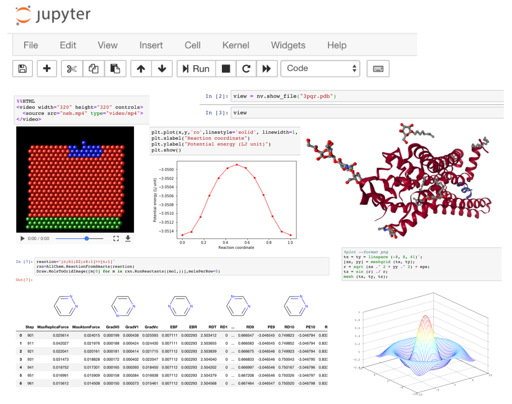

# TACCHEMZOO: TACC's Jupyter Notebook Environment for Computational Chemistry

Maintainer
==========  
Albert Lu  (alu@tacc.utexas.edu)

Table of contents
=================
* [Software](#Software)
* [Tutorials](#Tutorials)
* [Examples](#Examples)
* [FAQ](#FAQ)
* [Acknowledgment](#acknowledgment)
* [Cite](#cite)

Software
========

Platform and pre-installed packages:

- Jupyter Notebook (5.5.0)
- Kernels: python3, Octave
- Chemistry packages: ASE, GPAW, HOOMD-Blue, Gromacs, LAMMPS, RDKit, AMBER*, Gaussian\*, Gulp\*, NWChem\*, OpenKIM\*, Quantum ESPRESSO\*, Siesta\*, and VASP\* ( \*no build-in python interface).
- Pre-installed python packages: matplotlib, numpy, pandas, pytables, scipy, sympy, Theano.

For the full list of the software and details, please see [this page](./docs/Software.md)

Tutorials
=========

* [Platform access via TACC Visualization Portal](./docs/Tutorial_platform_access.md)
* [Parallel Computing in Jupyter Notebook (1) ipyparallel](./docs/Tutorial_ipyparallel.md)

More [Tutorials](./docs/Tutorials.md)

Examples
========
* [LAMMPS: Accelerate/in.phosphate][lmp-a3-h]
* [LAMMPS: Neb/in.neb.hop1][lmp-n2-h]
* [LAMMPS: Peptide/in.peptide][lmp-p1-h]  

[lmp-a3-h]: https://htmlpreview.github.io/?https://github.com/luxalatium/tcz_demo/blob/master/examples/lammps/accelerate/phosphate/lammps_accelerate_phosphate.html "accelerate-phosphate-h"
[lmp-n2-h]: https://htmlpreview.github.io/?https://github.com/luxalatium/tcz_demo/blob/master/examples/lammps/neb/hop1/lammps_neb_hop1.html "neb-hop1-h"
[lmp-p1-h]: https://htmlpreview.github.io/?https://github.com/luxalatium/tcz_demo/blob/master/examples/lammps/peptide/lammps_peptide.html "peptide-peptide-h"

More [Examples](./docs/Examples.md)

FAQ
===
[FAQ](./docs/Faq.md)

Acknowledgment
==============

Cite
====

----

Go to: [Software](./docs/Software.md), [Tutorials](./docs/Tutorials.md), [Examples](./docs/Examples.md), [FAQ](./docs/Faq.md)

