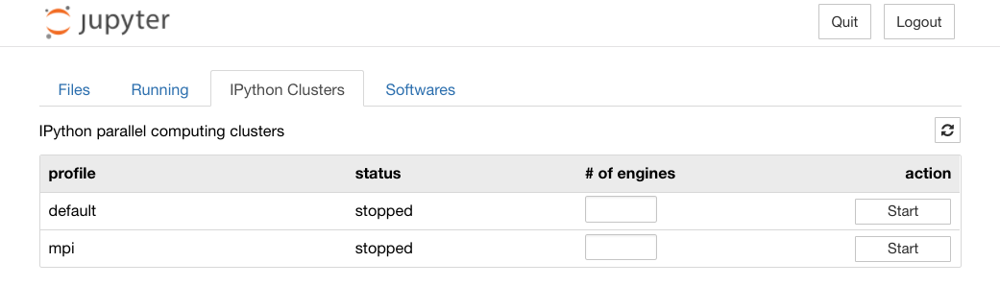

Parallel Computing in Jupyter Notebook (1) ipyparallel
=============================================

Table of contents
=================
* [Starting Ipcluster](#Starting-Ipcluster)
* [Ipyparallel Basic](#Ipyparallel-Basics)
    * [The client object](#The-client-object)
    * [The view class](#The-view-class)
    * [Python object transfer](#Python-object-transfer)
    * [Remote execution](#Remote-execution)
    * [Magic commands](#Magic-commands)

* [Resources](#Resources)


Starting Ipcluster
=================  
When starting an IPython/Jupyter Notebook session, TACC Visualization Portal will reserve one compute node for you in the desinated machine (say Stampede2). Each compute node has more than one processors that can be utilized for parallel computing. In the following, we will demonstrate how to run a simple parallel calculation in Jupyter Notebook using [ipyparallel][ref-ipyparallel] and [mpi4py][ref-mpi4py]. To install ipyparallel and enable the ipcluster tab in Jupyter for your account on Stampede2, please see the [instruction](./Instruction_ipyparallel.md) page.

Before running any parallel command, be sure to start `ipcluster` first. For Jupyter Notebook users, this can be done in the IPython Clusters tab (see snapshot below). For MPI applications (profile=`mpi`), enter the number of IPython engines (say *n*) and click the `Start` button. This will start a controller and *n* IPython engines on the compute node and are ready for parallel tasks. You may change the number of engines anytime. Just click the `Stop` button and enter the new number of engines, and then click the `Start` button to enable the new setting. 



Ipyparallel Basics
================= 

## The client object
In the Notebook, we first import the `ipyparallel` module followed by creating a `Client` object `rc` in the MPI mode to connect to the IPython cluster

```
In[1]: import ipyparallel as ipp
       rc = ipp.Client(profile='mpi')
```

Command `rc.ids` returns an ID list of engines that are connected to the controller. For example (n=8):

```
In [2]: rc.ids
Out[2]: [0, 1, 2, 3, 4, 5, 6, 7]
```
Say if we change the number of engines in the IPython Clusters tab to 4 and reload `rc`. The new ID list will reflect the change:

```
In [3]: rc = ipp.Client(profile='mpi')

In [4]: rc.ids
Out[4]: [0, 1, 2, 3]
```
## The View class
The `View` class is an extension of the Client object, which has two sub-classes, `DirectView` and `LoadBalancedView`, for users to interact with engines.  
`DirectView` is the simplest way to work with one or more engines directly, which can be constructed via list-access to the client. For example, the following command creates a DirectView for a single engine (ID=2):
```
dview = rc[2]
```
We can also create a DirectView for all engines:
```
dview = rc[:]
```
DirectView provides three flags, `targets`, `block`, and `track`, for controlling the behavior of remote execution.  The `targets` flag sets the engines that associate with this View. The following command assigns engine 1 and 3 to dview
```
dview.targets = [1,3]
```
Editing data in-place during non-copying sends might corrupt the message. In ipyparallel, numpy arrays are not copied when passed as arguments to apply() or via data-movement methods. Set `dview.track=True` will create a MessageTracker to notify the user whether it is safe to edit the arrays.

The `block` flag determins whether to wait for the result. The default behavior is non-blocking which returns an `AsyncResult` object immediately. We can use the `get()` method to retrieve the result at a later time. We can also get some useful metadata through `AsyncResult`, which provides useful task progress and timing information (see [ipyparallel documentation][ref-ipyparallel-ar] for more details).

## Python object transfer

In an IPython session, we can use `push()` and `pull()` to move python objects to/from engines.

```
In [5]: dview.block=True
        dview.push(dict(foo='bar'), block=True);

# Pull from all engines
In [6]: dview.pull('foo')
Out[6]: ['bar', 'bar', 'bar', 'bar']

# Pull from engin 0 only
In [7]: dview.pull('foo', targets=0)
Out[7]: 'bar'
```
In non-blocking mode, push() and pull() will return `AsyncResult` objects, and we can use get() to retrieve the results:
```
In [8]: ar=dview.pull('foo', block=False)
        ar.get()
Out[8]: ['bar', 'bar', 'bar', 'bar']
```

`DirectView` objects also provide a convenient dictionary-style access of object values:

```
In [9]: dview['bar']='foo'

In [10]: dview['bar']
Out[10]: ['foo', 'foo', 'foo', 'foo']
```
The operation `scatter()` partitions and sends a data sequence to different engines, and the operation `gather()` get the partitions back to the current IPython session

```
In [11]: data=[0, 1, 2, 3, 4, 5, 6, 7]
         dview.scatter('a',data, block=True)

In [12]: dview['a']
Out[12]: [[0, 1], [2, 3], [4, 5], [6, 7]]

In [13]: dview.gather('a').get() 
Out[13]: [0, 1, 2, 3, 4, 5, 6, 7]
```

## Remote execution
A Python function can be executed on the engines using the `apply()` method of the View object:

```
dview.apply(f, args, kwargs)
```

where `f` is the function to be called; `args` and `kwargs` are respectively the positional and keyword arguments passed to f. In the following example, we compute `f(3)` on each engine, where f(x)=a*x and a is set to 5:

```
In [14]: dview['a'] = 5
         dview.apply(lambda x: a*x, 3)
Out[14]: [15, 15, 15, 15]
```

The `execute()` method takes a string of Python code instead of a function to execute. The output can be shown by using `display_outputs()`:

```
In [15]: ar=dview.execute('print("hi")')
         ar.display_outputs()

[stdout:0] hi
[stdout:1] hi
[stdout:2] hi
[stdout:3] hi
```

Similarly, the `run()` method read and execute a Python file:

```
In [16]: ar=dview.run('PrintPi.py')
         ar.display_outputs()

[stdout:0] 3.141592653589793
[stdout:1] 3.141592653589793
[stdout:2] 3.141592653589793
[stdout:3] 3.141592653589793
```

where the file PrintPi.py is simply:

```
import math
print(math.pi)
```
## Magic commands

Ipyparallel also provides a few magic commands for users to execute parallel commands on the engines interactively.  
For example, the `%px` magic executes a single Python command on the engines:

```
In [17]: %px print('hi')

[stdout:0] hi
[stdout:1] hi
[stdout:2] hi
[stdout:3] hi
```

which is equivalent to 

```
In [18]: ar=rc[:].execute('print('hi')')
         ar.display_outputs()

[stdout:0] hi
[stdout:1] hi
[stdout:2] hi
[stdout:3] hi
```

The `%%px` magic executes the whole cell on the engines
```
In [19]: %%px
         import math
         F=2.0*math.sin(0.25*math.pi)
         print(F)

[stdout:0] 1.414213562373095
[stdout:1] 1.414213562373095
[stdout:2] 1.414213562373095
[stdout:3] 1.414213562373095
```

More useful parallel magic commands can be found in the [ipyparallel documentation][ref-ipyparallel-mg].

[ref-ipyparallel]:https://ipyparallel.readthedocs.io/en/latest/
[ref-ipympi]:https://ipyparallel.readthedocs.io/en/latest/mpi.html
[ref-mpi4py]:https://mpi4py.readthedocs.io/en/stable/index.html
[ref-ipyparallel-ar]:https://ipyparallel.readthedocs.io/en/latest/asyncresult.html#parallel-asyncresult
[ref-ipyparallel-mg]:https://ipyparallel.readthedocs.io/en/latest/magics.html

Resources
================= 

Ipyparallel documentation:  
https://ipyparallel.readthedocs.io/en/latest/  
Ipyparallel examples:  
https://github.com/ipython/ipyparallel/tree/master/examples

---

Go to: [Home](../README.md), [Software](./Software.md), [Tutorials](./Tutorials.md), [Examples](./Examples.md), [FAQ](./Faq.md)