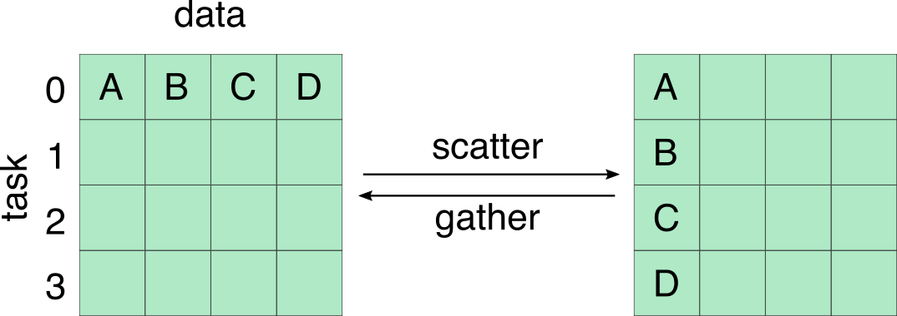
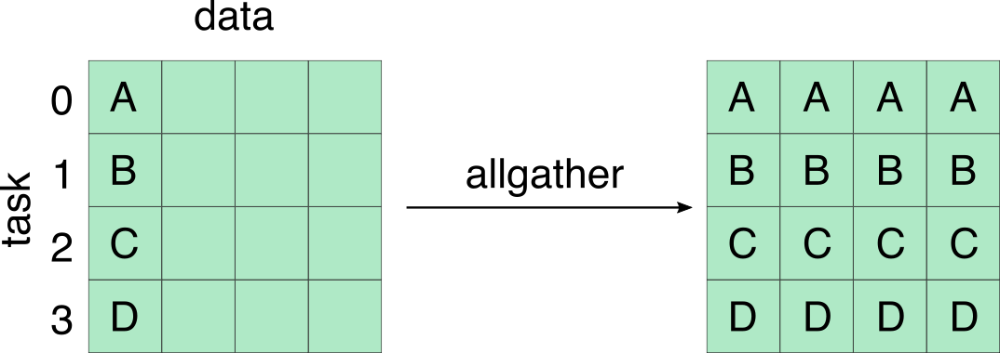
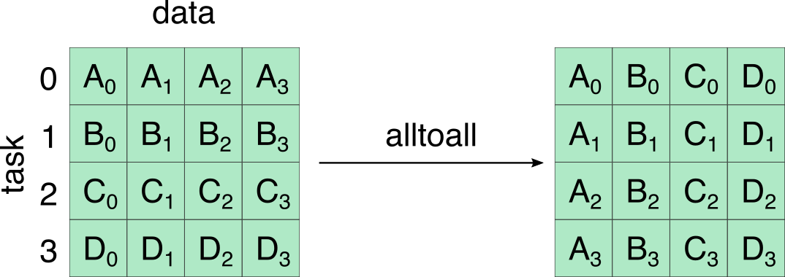

Parallel Computing in Jupyter Notebook (2) MPI4Py 
=============================================

Table of contents
=================
* [MPI basics](#MPI-Basics)
* [Point-to-point communication](#Point-to-point-communication)
    * [Blocking communication](#Blocking-communication)
    * [The MPI.Status Class](#The-MPI.Status-class)
    * [Non-blocking communication](#Non-blocking-communication)
* [Collective communication](#Collective-communication)
* [Resources](#Resources)

MPI basics  
=================  
An **MPI** (Message Passing Interface) program is launched as separate tasks. Each task has its own address space, and data is explicitly moved from task to task (message passing). MPI not only works on separate processors connected by any network but also works on shared memory systems. Due to its high scalability and performance, MPI will remain a crucial component of high performance computing.
**MPI4Py** is one of the implementations of MPI on Python, which provides an interface very similar to the MPI Standard C++ Interface that allows us to communicate Python objects and array data. In this tutorial, we will give a brief overview of basic functionality of MPI4Py that you can implement in the Notebook.

A **group** is defined as an ordered set of MPI tasks. Each task has an unique ID called **rank** (=0, 1, 2, ...). The tasks communicate with each other through **communicators**. In MPI4Py, `MPI.Comm` is the base class of communicator, which has two sub-classes: `MPI.Intracomm` and `MPI.Intercomm` for communication within a single group and between different groups respectively.  `MPI.COMM_SELF` and `MPI.COMM_WORLD` are two pre-defined intracommunicator instances. While `MPI.COMM_WORLD` includes all the tasks, `MPI.COMM_SELF` contains only the calling task.

The following is our first MPI example. To run the code in Jupyter, be sure to start `ipcluster` first with four IPython engines (see [instruction](./Tutorial_ipyparallel.md)), and then import the `ipyparallel` module followed by creating a `Client` object `rc` in the MPI mode to connect to the IPython cluster

```
In [1]: import ipyparallel as ipp
        rc = ipp.Client(profile='mpi')
        rc.ids # Show engine IDs
Out[1]: [0, 1, 2, 3]
```

Use the cell magic `%%px` to execute the following codes

```
In [2]: %%px
        from mpi4py import MPI
        comm = MPI.COMM_WORLD

        print("Hello! I’m rank %02d from %02d on host %s" % (comm.Get_rank(), comm.Get_size(), MPI.Get_processor_name()))
```

Note that `MPI_Init()` is actually called when we import the MPI module from MPI4Py. There is no need to call it again. Similarly, `MPI_Finalize()` is automatically called when Python processes exit.

The output looks like:

```
        [stdout:0] Hello! I’m rank 00 from 04 on host c506-071.stampede2.tacc.utexas.edu
        [stdout:1] Hello! I’m rank 01 from 04 on host c506-071.stampede2.tacc.utexas.edu
        [stdout:2] Hello! I’m rank 02 from 04 on host c506-071.stampede2.tacc.utexas.edu
        [stdout:3] Hello! I’m rank 03 from 04 on host c506-071.stampede2.tacc.utexas.edu
```

Function `comm.Get_rank()` (or simply comm.rank) and `comm.Get_size()` (or comm.size) return the rank of the task and the size of the group respectively. `MPI.Get_processor_name()` returns the hostname of the compute node.

For some complex use cases, it might be helpful to create more than one communicator to handle several tasks concurrently. Here is an example of using method `comm.Split` to create two communicators from MPI.COMM_WORLD (of 6 MPI tasks):

```
In [3]: import ipyparallel as ipp
        rc = ipp.Client(profile='mpi')
        rc.ids
Out[3]: [0, 1, 2, 3, 4, 5]

In [4]: %%px
        from mpi4py import MPI
        comm = MPI.COMM_WORLD

        world_rank = comm.rank 
        world_size = comm.size
        color = world_rank % 2

        if (color==0):
            key = +world_rank 
        else:
            key = -world_rank

        newcomm = comm.Split(color, key)
        newcomm_rank = newcomm.rank
        newcomm_size = newcomm.size

        for i in range(world_size):
            comm.Barrier() 
            if (world_rank==i):
                print("Global: rank %d of %d (key=%2d). New comm: rank %d of %d" % (world_rank, world_size, key, newcomm_rank , newcomm_size))

        newcomm.Free()
```

The output is:
```
[stdout:0] Global: rank 0 of 6 (key= 0). New comm: rank 0 of 3
[stdout:1] Global: rank 1 of 6 (key=-1). New comm: rank 2 of 3
[stdout:2] Global: rank 2 of 6 (key= 2). New comm: rank 1 of 3
[stdout:3] Global: rank 3 of 6 (key=-3). New comm: rank 1 of 3
[stdout:4] Global: rank 4 of 6 (key= 4). New comm: rank 2 of 3
[stdout:5] Global: rank 5 of 6 (key=-5). New comm: rank 0 of 3
```
In `comm.Split(color, key)`, all tasks of the same `color` are assigned to the same communicator. The new ranks are ordered with ascending `key` values. It’s important to note that the original communicator does not go away, but a new communicator is created on each MPI task. At the end of the above code, we used `Free()` to destroy the communicator.

Point-to-point communication
=================

In **point-to-point** communication, messages are sent from one MPI task to another. A message can contain any number of Python native or user defined types with an associated tag. MPI4Py (and MPI) handle the packing and unpacking for user defined data types. Two major operation modes, **blocking** and **non-blocking** will be discussed as follows:

## Blocking communication  
In blocking mode, caller function does not return until the message has been reveived and the memory block that contains the data can be safely used for subsequent instructions. If message passing cannot be completed, a **deadlock** situation can occur. In MPI4Py, the communicator class provides two methods, `send` and `recv` for the blocking communication of general Python objects:
```
comm.send(data, dest=0, tag=0)
```
and

```
data = comm.recv(obj=None, source=0, tag=0, status=None)
```
where `data` is the Python object to be sent/reveived, `source`/`dest` is the rank of the source/destination task, and `tag` is the ID given to the message, which allows selectivity of messages at the receiving end. If not specified, the default values of source, dest, and tag are `0`. The object `obj` is optional, which must be a writable python buffer. Using its predefined value (None) will lead to an automatic dynamical allocation of memory for data communication. `status` is also optional, which is used to retrieve information about the received message. During message passing, destination/source ranks as well as tags have to match. However, we can use source=`MPI.ANY_SOURCE` and tag=`MPI.ANY_TAG` in the recv/Recv methods to retrieve the received message irrespective of its source or tag value.

Python objects are converted (serialized) to byte streams at sending processes, and the streams are converted back to Python objects at receiving processes. This conversion process imposes overheads in both memory and processor usage, especially when communicating objects with large memory footprints. However, MPI4Py supports direct communication of any object exporting the single-segment buffer interface (such as NumPy arrays) with very little overhead. The corresponding methods that can communicate memory buffers are `Send` and `Recv` (upper case). Here is a summary of the two send/receive types:
```
send / recv : general Python objects, slow 
Send / Recv : contiguous arrays, fast
```

Here is an example of the send/receive method with two MPI tasks:

```
In [3]: import ipyparallel as ipp
        rc = ipp.Client(profile='mpi')
        rc.ids
Out[3]: [0, 1]

In [4]: %%px
        from mpi4py import MPI 
        comm = MPI.COMM_WORLD

        # make we have two MPI tasks
        assert comm.size == 2

        if comm.rank == 0:
            sendmsg = 123
            comm.send(sendmsg, dest=1, tag=11)
            recvmsg = comm.recv(source=1, tag=22)
            print("[%02d] Received message: %s" % (comm.rank, recvmsg))
        else:
            recvmsg = comm.recv(source=0, tag=11)
            print("[%02d] Received message: %d" % (comm.rank, recvmsg))
            sendmsg = "Message from 1"
            comm.send(sendmsg, dest=0, tag=22)
```
We should get the following output:
```
[stdout:0] [00] Received message: Message from 1
[stdout:1] [01] Received message: 123
```
Similarly, we use Send/Receive to communicate Numpy arrays in the following example:
```
In [5]: %%px
        from mpi4py import MPI
        import numpy
        comm = MPI.COMM_WORLD

        assert comm.size == 2

        rank = comm.rank

        # pass explicit MPI datatypes
        if rank == 0:
            data = numpy.arange(10, dtype='i')
            comm.Send([data, MPI.INT], dest=1, tag=77)
        elif rank == 1:
            data = numpy.empty(10, dtype='i')
            comm.Recv([data, MPI.INT], source=0, tag=77)
            print("[%02d] Received: %s" % (rank, data))

        # automatic MPI datatype discovery
        if rank == 0:
            data = numpy.arange(10, dtype=numpy.float64)
            comm.Send(data, dest=1, tag=13)
        elif rank == 1:
            data = numpy.empty(10, dtype=numpy.float64)
            comm.Recv(data, source=0, tag=13)
            print("[%02d] Received: %s" % (rank, data))
```
And the output is :
```
[stdout:1] 
[01] Received: [0 1 2 3 4 5 6 7 8 9]
[01] Received: [0. 1. 2. 3. 4. 5. 6. 7. 8. 9.]
```
## The MPI.Status class

To access the `status` information of the recv/Recv methods, we first create an instance of Status-class and pass it to the recv/Recv status parameter:

```
status = MPI.Status()
comm.Recv(data, source, tag, status)
```

The following information can be obtained from the class Status instance:
```
status.Get_source()             [source rank]
status.Get_tag()                [tag value]
status.Get_elements(datatype)   [number of elements in message]
status.Get_count()              [message size in Byte]
```

The following is an example for retrieving information from Status. Here we used `%%px --noblock` to execute the code in non-blocking mode:

```
In [6]: %%px --noblock

        from mpi4py import MPI
        import numpy as np

        comm = MPI.COMM_WORLD
        assert comm.size == 2

        rank = comm.rank
        status = MPI.Status()

        # pass explicit MPI datatypes
        if rank == 0:
            data = np.arange(1000, dtype='i') 
            comm.Send([data, MPI.INT], dest=1, tag=77)
            
        elif rank == 1:
            data = np.arange(1000, dtype='i') 
            comm.Recv([data, MPI.INT], source=MPI.ANY_SOURCE , tag=MPI.ANY_TAG , status=status)
            source = status.Get_source()
            tag = status.Get_tag()
            print("[%02d] Received data from source %d with tag %d" % (rank, source, tag))

Out[6]: <AsyncResult: execute>
```
Then we use `%pxresult` to retreive the result
```
In [7]: %pxresult

[stdout:1] [01] Received data from source 0 with tag 77
```
## Non-blocking communication
Both `Send` and `Recv` (and their lower-case variants) perform blocking communication. These functions block the caller until the communication is finished. On many systems, performance can be significantly increased by overlapping communication and computation. MPI4Py provides non-blocking send and receive functions (Isend/Irecv) which make the overlap possible. The non-blocking functions Isend/Irecv return an instance of the class `Request`, which provides two methods `Test` and `Wait` and their variants for obtaining the status of the communication. You can even cancel a communication by using `Cancel()`.

```
– Test/Testany/Testall [check if one/any/all pending requests finished]
– Wait/Waitany/Waitall [wait until one/any/all pending requests finished]
```
Here's an example of non-blocking communication (two tasks) using Isend/Irecv together with the Request/Test/Wait methods:

```
In [8]: import ipyparallel as ipp
        rc = ipp.Client(profile='mpi')
        rc.ids
Out[8]: [0, 1]

In [9]: %%px
        import numpy
        import time
        from mpi4py import MPI

        comm = MPI.COMM_WORLD
        rank = comm.rank 
        size = comm.size

        data=numpy.arange(5,dtype=numpy.float64)

        if rank == 0:
            data=numpy.arange(5,dtype=numpy.float64)
            time.sleep(5)  # Wait for 5 seconds before sending data
            request = comm.Isend([data,5,MPI.DOUBLE],1,0)
            
        elif rank == 1:
            data = numpy.zeros(5,dtype=numpy.float64)
            print('Task', rank, ': original data =', data)
            
            request = comm.Irecv(data, source=0, tag=0)
            result = False
            count = 0
            while result == False :
                result = MPI.Request.Test(request)
                print('Test(t=%ds), result =' % count, result)
                time.sleep (1) # Do test every second
                count += 1

            result = MPI.Request.Wait(request)
            print('Wait result',result)
            print('Task', rank, ': final data =', data)
```
Note that task 0 will wait for 5 seconds before sending the data and task 1 enquires the status every second until the data arrives. The final output is:

```
[stdout:1] 
Task 1 : original data = [0. 0. 0. 0. 0.]
Test(t=0s), result = False
Test(t=1s), result = False
Test(t=2s), result = False
Test(t=3s), result = False
Test(t=4s), result = False
Test(t=5s), result = True
Wait result True
Task 1 : final data = [0. 1. 2. 3. 4.]
```

In the second example (with 4 tasks), we use the method `Waitall()` to wait for all given MPI Requests (in the list `requests`) to complete:
```
In [8]: import ipyparallel as ipp
        rc = ipp.Client(profile='mpi')
        rc.ids
Out[8]: [0, 1, 2, 3]

In [9]: %%px --noblock

        from mpi4py import MPI
        import numpy as np
        import time

        comm = MPI.COMM_WORLD
        rank = comm.rank
        size = comm.size

        if rank == 0:

            # Request data from a set of processes
            requests = [MPI.REQUEST_NULL for i in range(0,size)]
            d = np.zeros (size, dtype='i')
            print("[%02d] Original data %s " % (rank, d)) 

            for i in range (1, size):
                requests[i] = comm.Irecv([d[i:], 1, MPI.INT], i, MPI.ANY_TAG)

            status = [MPI.Status() for i in range(0,size)]

            # Wait for all the messages
            MPI.Request.Waitall(requests, status)
                                    
            for i in range(1,size):
                source = status[i].source
                tag = status[i].tag
                assert d[i] == source; assert d[i] == tag

            print("[%02d] Received data %s " % (rank, d))
                            
        else:
            data = np.array ([rank])
            time.sleep (np.random.random_sample()) 
            request = comm.Isend ([data[:], 1, MPI.INT], 0, rank)
            request.Wait()

Out[9]: <AsyncResult: execute>
```
The output is:
```
In[10]: %pxresult

[stdout:0] 
[00] Original data [0 0 0 0] 
[00] Received data [0 1 2 3] 
```

Collective communication
=============================
In collective communications, multiple tasks within the same communicator can exchange messages and possibly perform operations. Unlike point-to-point communication, collective communications are always **Blocking** and messages are **NOT** paired with an associated tag. Three types of commonly used collective communication operations: (1) *barrier synchronization*, (2) *global data communication*, and (3) *global data reduction* will be discussed in the following. Again, all-lowercase methods of the `MPI.Comm` class (e.g. `bcast` and `scatter`) are used to communicate generic Python objects, whereas methods start with an upper-case letter (e.g. `Bcast` and `Scatter`) are for buffer-like objects.

## Barrier synchronization

Any task calling `MPI.Comm.Barrier()` will be blocked until all the tasks within the group have called it.
In the following example, we use `Barrier()` to synchronize two independent loops that print the elapsed time at each iteration

```
In [8]: import ipyparallel as ipp
        rc = ipp.Client(profile='mpi')
        rc.ids
Out[8]: [0, 1]

In [9]: %%px
        from mpi4py import MPI
        import numpy as np
        import time

        comm = MPI.COMM_WORLD
        np.random.seed(1)

        # Set T0
        start_time = time.time()
            
        for i in range(6):
            
            # Adding random pause time: avg(dT_task1)~2*avg(dT_task0)
            time.sleep(np.random.random_sample()*(rank+1)*2)
            
            # Synchronization starting i=3
            if i > 2: comm.Barrier()
                
            # Print elapsed time T-T0
            print("%d %.2f sec" % (i,time.time()-start_time))
```
From the output we can see that the two loops were synchronized starting from i=3
```
[stdout:0] 
0 0.84 sec
1 2.28 sec
2 2.28 sec
3 5.78 sec
4 6.37 sec
5 6.74 sec

[stdout:1] 
0 1.67 sec
1 4.56 sec
2 4.57 sec
3 5.78 sec
4 6.37 sec
5 6.74 sec
```

## Global data communication

In MPI4Py, `Bcast()` and `bcast()` broadcasts data from one member to all members of a group:

```
MPI.Comm.Bcast(data, int root=0)              [general Python objects]
data = MPI.Comm.bcast(obj=None, int root=0)   [buffer-like objects] 
```
Note that in method `bcast`, the broadcasted data (i.e. `obj` from root) will be copied to the `data` object

<p align="center">

</p>

Example:
```
In [8]: import ipyparallel as ipp
        rc = ipp.Client(profile='mpi')
        rc.ids
Out[8]: [0, 1, 2, 3]

In [9]: %%px
        from mpi4py import MPI
        comm = MPI.COMM_WORLD
        rank = comm.Get_rank()

        if rank == 0:
            data = {'key1' : [1, 2.0], 'key2' : ('abc','ABC')} 
        else:
            data = None

        data = comm.bcast(data, root=0)    
        print("Data on rank %d is " % rank, data)
```

Output:
```
[stdout:0] Data on rank 0 is  {'key1': [1, 2.0], 'key2': ('abc', 'ABC')}
[stdout:1] Data on rank 1 is  {'key1': [1, 2.0], 'key2': ('abc', 'ABC')}
[stdout:2] Data on rank 2 is  {'key1': [1, 2.0], 'key2': ('abc', 'ABC')}
[stdout:3] Data on rank 3 is  {'key1': [1, 2.0], 'key2': ('abc', 'ABC')}
```

`MPI.Comm.scatter()` scatters data from one member to all members of a group, and `MPI.Comm.gather()` gathers data from all members to one member of a group:

<p align="center">

</p>

<p align="center">

</p>

<p align="center">

</p>

## Global data reduction

Coming soon


More useful parallel magic commands can be found in the [MPI4Py documentation][ref-mpi4py].

[ref-mpi4py]:https://mpi4py.readthedocs.io/en/stable/index.html

Resources
====
MPI4Py website:  
https://ipyparallel.readthedocs.io/en/latest/  

---

Go to: [Home](../README.md), [Software](./Software.md), [Tutorials](./Tutorials.md), [Examples](./Examples.md), [FAQ](./Faq.md)
