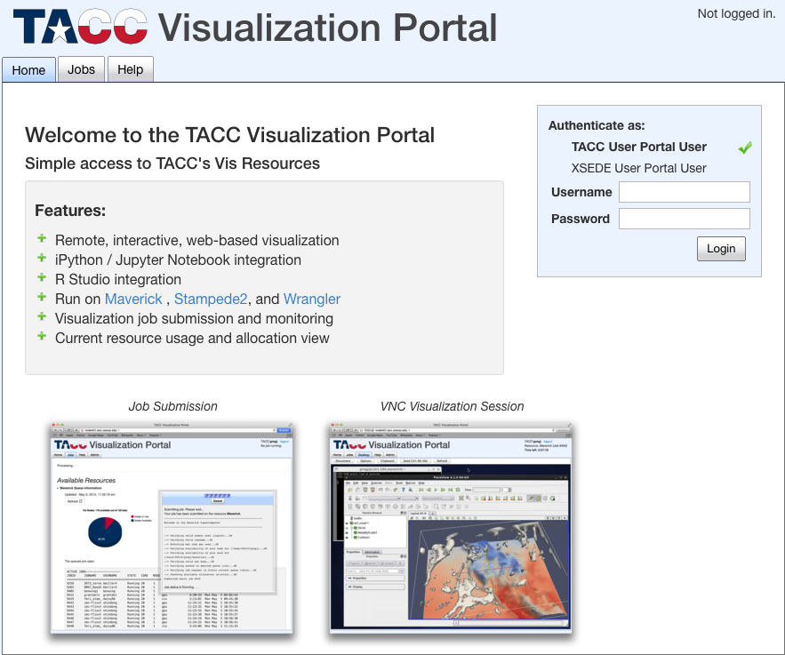
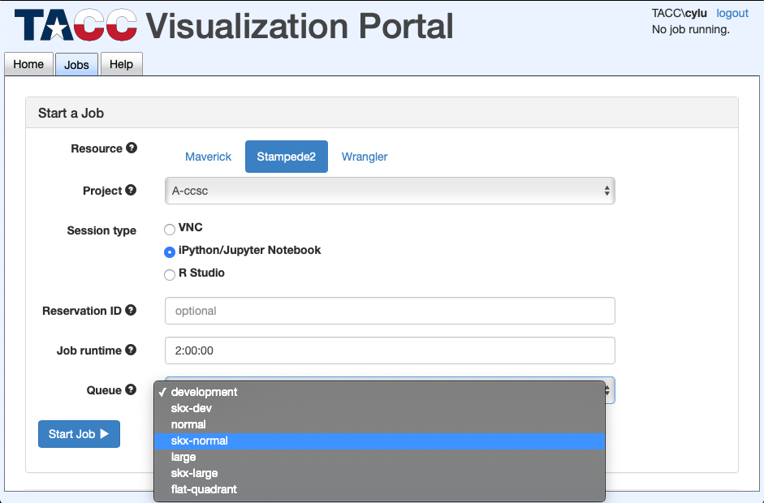
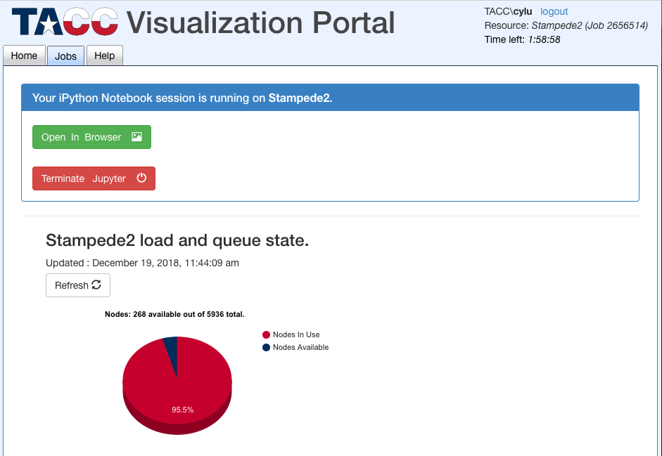
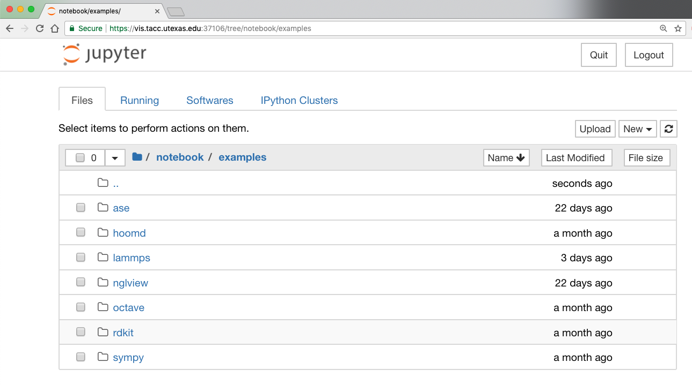

Platform Access via TACC Visualization Portal
=============================================

## Step 1: Log in

Log in to TACC Visualization Portal (https://vis.tacc.utexas.edu/).

---
## Step 2: Start an IPython session
  
Start an IPython/Jupyter Notebook job on Stampede2.  
Choose a queue type based on your need (e.g. use `normal` queue for reserving a KNL node) 
and specify the job runtime (HH:MM:SS).  

---
## Step 3: Start a Jupyter Notebook server

Once the job is running, you can start a Jupyter Notebook server

---
## Step 4: Open Jupyter Notebook dashboard

Click "Open in Browser" button to open Jupyter Notebook Dashboard

---

Go to: [Home](../README.md), [Software](./Software.md), [Tutorials](./Tutorials.md), [Examples](./Examples.md), [FAQ](./Faq.md)